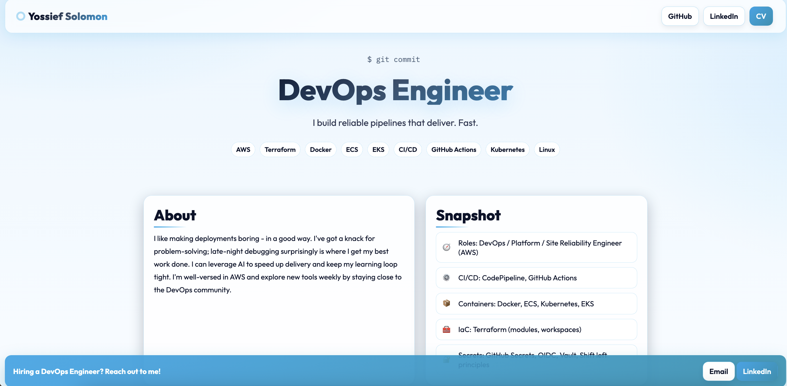
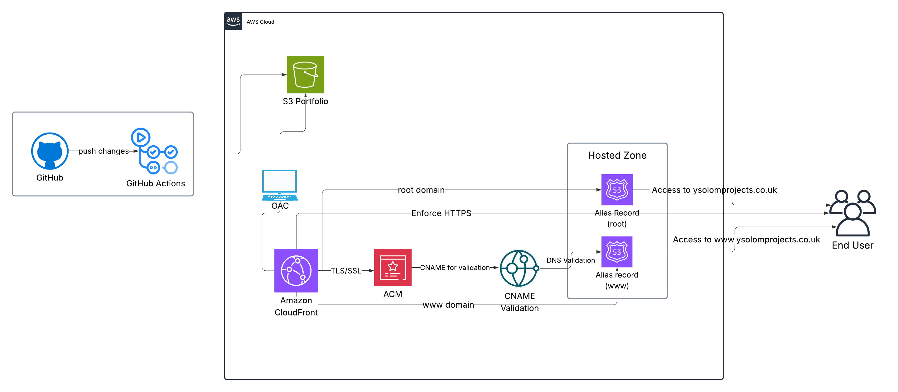
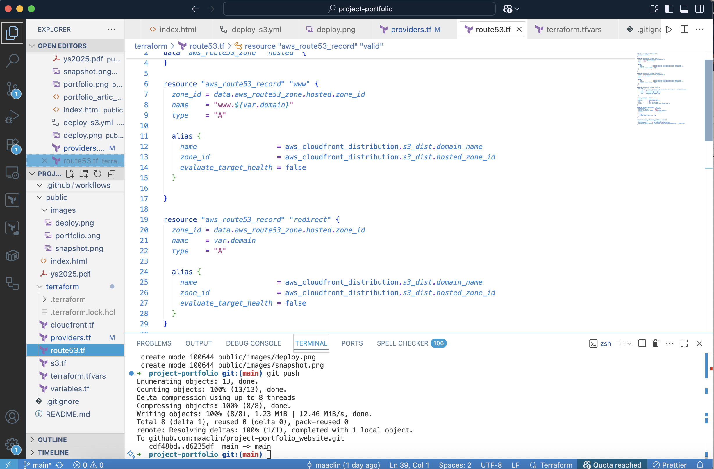
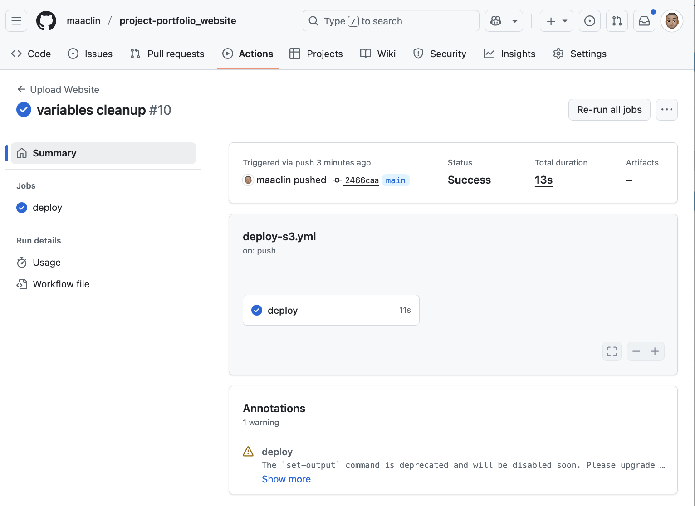

# Project - Portfolio hosted on S3 + CloudFront 
--- 

## Check it out @ www.ysolomprojects.co.uk 



--- 

## Architecture Diagram  



## Check out my Loom video on how I did it: 

[](https://www.loom.com/share/0d39e201e36b440e9c9da0ec6bfb2b88)

---

## Project Structure

```
├── .github/workflows
│   └── deploy-s3.yml
├── public
│   ├── images
│   │   ├── deploy.png
│   │   ├── portfolio.png
│   │   └── snapshot.png
│   ├── index.html
│   └── ys2025.pdf
├── terraform
│   ├── cloudfront.tf
│   ├── providers.tf
│   ├── route53.tf
│   ├── s3.tf
│   ├── terraform.tfvars
│   └── variables.tf
└── README.md
```
---
##  Technologies Used

- S3 - Static website hosting
- CloudFront - Content delivery and caching
- Route 53 - Domain routing and DNS management 
- ACM - SSL/TLS certificates and validation 
- Terraform - IaC for resources
- GitHub Actions - Automatic deployment to s3

--- 

## Summary 

I am hosting my own personal portfolio webpage, hosted on S3 through static website hosting, with CloudFront serving the site and Route 53 handling DNS. Using Terraform, I created a bucket and attached a policy that allows the OAC from my CloudFront distribution to access S3 bucket objects. Public access is completely blocked to keep the files secure while still letting CloudFront retrieve them.

This setup follows the move from OAI to OAC, which is more secure and removes the need for extra IAM policies. The distribution uses index.html as the root object and includes aliases for both the root domain and the www subdomain. I configured CloudFront to redirect HTTP to HTTPS so end users always access the secure version of the site.

The ACM certificate is created first, before the CloudFront distribution to avoid dependency errors, since CloudFront requires a valid certificate ARN at creation time. I used a data block to reference the already existing hosted zone for ysolomprojects.co.uk. Then, I created alias A records for both the root and www domains, which point to the CloudFront distribution. Using AWS’s alias records means I don’t need to manage IP addresses; AWS resolves that dynamically.

Including both domain versions ensures users can reach the site whether or not they include www. in the URL.

To validate the ACM certificate, I created a for_each block to generate CNAME validation records—one for each domain (www and the root). These records are required so ACM can verify ownership and issue the certificate. Without this validation step, the certificate would stay in a "Pending" state, and the site wouldn’t be able to serve HTTPS traffic.


## GitHub Actions Pipeline  



I also created a GitHub Actions workflow that allows me to push changes to GitHub and automatically update my website. It syncs updated files to the S3 bucket and deletes any outdated files once the new ones are uploaded. This removes the need to re-run Terraform every time I make content changes.
